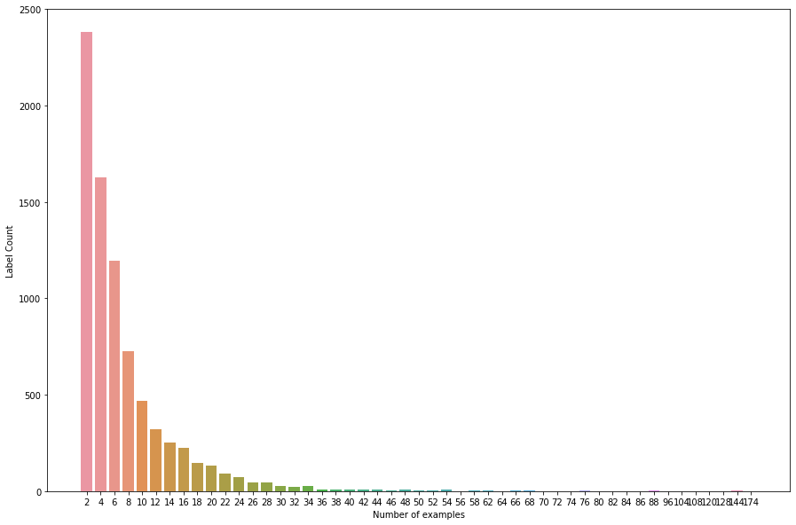

## Shell-identification

# Problem Statement:

The shell dataset was labeled by its scientific name such as Aandara consociata, etc.
The goal is to predict the likelihood that a shell is from a certain class from the provided labels, thus it is a multi-class classification problem.
The goal is to train a classifier that would be able to classify the shell into these labels.

## Project feasibility:
# Data Exploration and Visualizations:
The dataset consists of 7894 shell species with 29622 samples, where totally 59244 shell images are present.
Each species has shell samples ranging from 1 to 87 respectively, and every shell sample has two photographs with frontal and lateral view.
Each image is labelled with its scientific name and of size 300*400 pixels.

Fig1: Aandara_consociata_10_A.jpg

Fig2: Count plot of each label

Fig2. shows that the data is highly imbalanced

Fig3: Number of examples in each label

From Fig3 we can see that, around 2400 labels have only 2 examples(which is 1
shell image with 2 different views), so for those labels it’s hard to train to make the
network learn features and we may not have images for testing and validation. There
are very few groups having adequate examples.
So I omitted validation and took the train set and test set of images only.

# Pre-processing:
The original image was of 300*400 but I reduced the size to 224*224. As depicted above that
the dataset doesn’t have enough data, I took the training set to 80% and test set to 20% data
omitting validation.
Keras ImageDataGenerators was used to load the dataset which makes it efficient to load
images in batches. Training data was shuffled during the training.

# Metrics:
The metric used is categorical cross entropy, which sets a probability to each label for all
images.

In the above equation if the class label is 1(the image is from that class) and the predicted probability is near to 1, then log(p_y) is low and contributes a small amount of loss to the total loss.

## Models:
# Baseline model:
This model was a simple classifier to test the baseline performance. I have tried this baseline model as a good-practice.

# Motivation for using Mobile-net:
There is a tradeoff between accuracy and computational power when using various pre-trained state-of-art models for our problem.
There is a trend of making the model more complex increasing the depth of the model which increases the accuracy but the computational power needed is also increased since it involves more calculations. So mobile-net overcomes this using depth separable convolution instead of standard convolution which decreases the computation. Also the accuracy of mobile net on imagenet classification is better and similar to other models.

# Refinement:
- Horizontal flip and rotation(45) was made for training data using ImageDataGenerator.

    
    Fig: Horizontal flip and rotation (45)

- Dropout:
    The model was overfitting so I used one of the techniques to prevent overfitting i.e dropout by 0.1.

The model with data augmentation was computationally expensive, it was taking
longer time to train the model. So I planned to train the model for a shorter epoch(5).

# For labels with images more than 40:

    There are 71 labels having more than 40 images.

I tried testing these labels to see if the model works better if we have more images and doing this we get 4582 dataset.

## Evaluations and results:

Overall results: [Results in sheet][3]

1. Simple Base model:
    Plot 

    

    Test set result:

    |  | Precision | Recall | F1 Score | Support |
    |--| --------- | ------ | -------- | ------- |
    |accuracy| | | 0.347371 | 11849 |
    | Macro avg | 0.1817755 | 0.204980 | 0.179300 | 11849 |
    | Weighted avg | 0.2790337 | 0.347371 | 0.285979 | 11849|

2. Mobile-net trained for 15 epochs:
    Plot 

    

    Test set result:

    |  | Precision | Recall | F1 Score | Support |
    |--| --------- | ------ | -------- | ------- |
    |accuracy| | | 0.47 | 11849 |
    | Macro avg | 0.3389876 | 0.363136 | 0.328312 | 11849 |
    | Weighted avg | 0.4675834 | 0.471600 | 0.438162 | 11849|

3. Data augmentation on Mobile-net:
    Since the result shows that the model is overfitting I do not want to add more augmentation on the data, so I have just made a horizontal flip and rotation by 45 degree.

    

    |  | Precision | Recall | F1 Score | Support |
    |--| --------- | ------ | -------- | ------- |
    |accuracy| | | 0.412524 | 11849 |
    | Macro avg | 0.2900279 | 0.318409 | 0.279691 | 11849 |
    | Weighted avg | 0.4121459 | 0.412524 | 0.378711 | 11849|

4. Dropout:

    

    |  | Precision | Recall | F1 Score | Support |
    |--| --------- | ------ | -------- | ------- |
    |accuracy| | | 0.227192 | 11849 |
    | Macro avg | 0.1157586 | 0.147622 | 0.113464 | 11849 |
    | Weighted avg | 0.1946501 | 0.227192 | 0.182527 | 11849|

5. For 71 labels:

    ![labels-71] (./img/labelseventy.png)

    |  | Precision | Recall | F1 Score | Support |
    |--| --------- | ------ | -------- | ------- |
    |accuracy| | | 0.73 | 11849 |
    | Macro avg | 0.63 | 0.63 | 0.60 | 11849 |
    | Weighted avg | 0.74 | 0.73 | 0.70 | 11849|

    From the plot above we can see that this model is working well though it still has high variance but we can analyze that this model can be improved by decreasing the network complexity or may be having more dropout or regularizing.

## Conclusion & Recommendation:
As we can see from the above results that the training accuracy is increasing while the F1 score of test data is poor, clearly the model is overfitting on the training data. With data augmentation the training accuracy is a little more stable and the F1 score for test data but the results are not good.

To make this system production ready we need to get more images for the shell.
From the results above we can say that the model performs better if we have more data. Approximately, 2400 labels have only 2 images (i.e only 1 shell) so it is harder for the model to learn features from those labels.

We can see from the results for 71 labels for which each label has 40 images, the accuracy is increased and this accuracy can still be improved.

References:
- [Mobile-net paper][1]
- [Transfer-learning-using-mobilenet][2]

[1]: https://arxiv.org/abs/1704.04861
[2]: https://towardsdatascience.com/transfer-learning-using-mobilenet-and-keras-c75daf7ff299
[3]: https://docs.google.com/spreadsheets/d/1GWLSx46TZpQoIF3RDBD__70XqZ4KTFnaZZB0-GDRTIE/edit